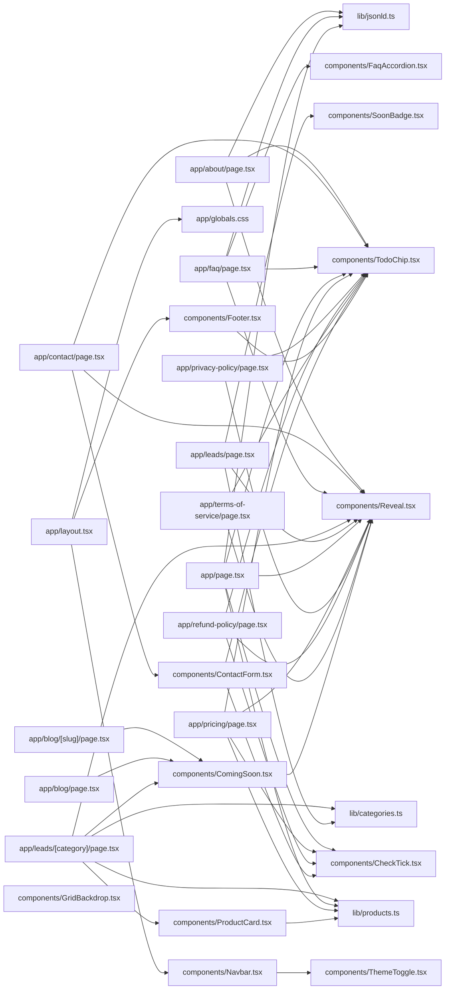

# Codebase graph

Generated by `npm run graph` (madge). This Mermaid diagram renders on GitHub,
in VS Code with the "Markdown Preview Mermaid Support" extension, or by pasting
into https://mermaid.live. For an SVG image, install Graphviz and run
`npm run graph:svg`.

- Modules: 29
- Dependency links: 45
- Circular dependencies: none

